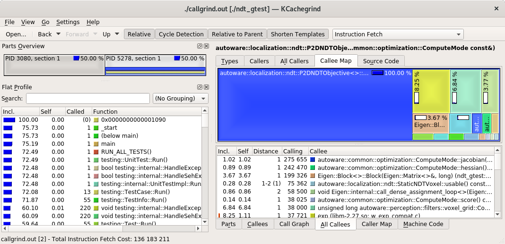
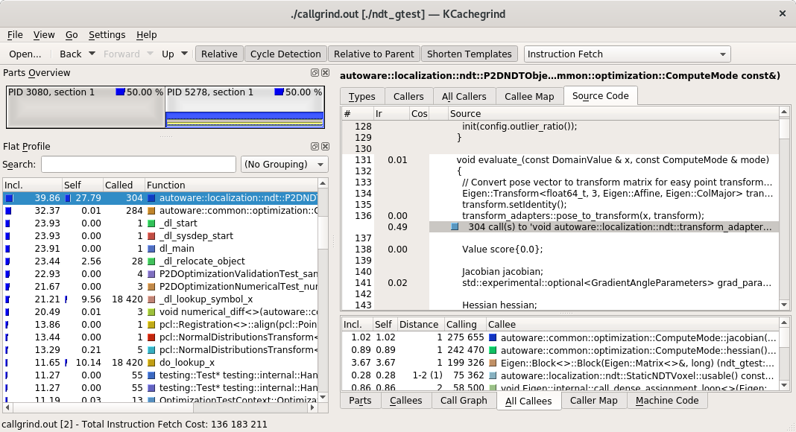

# sources
  - autoware home:  https://gitlab.com/autowarefoundation/autoware.auto/AutowareAuto
  - autoware docs:  https://autowarefoundation.gitlab.io/autoware.auto/AutowareAuto/installation.html
  - install ADE:    https://ade-cli.readthedocs.io/en/latest/install.html
  - install docker: https://docs.docker.com/engine/install/debian/#install-using-the-repository


# install docker on debian
install docker: https://docs.docker.com/engine/install/debian/#install-using-the-repository

## install docker feature
from [4]:
command:
```
$ sudo apt-get install     apt-transport-https     ca-certificates     curl     gnupg-agent     software-properties-common
$ curl -fsSL https://download.docker.com/linux/debian/gpg | sudo apt-key add -
$ sudo apt-key fingerprint 0EBFCD88
$ sudo add-apt-repository    "deb [arch=amd64] https://download.docker.com/linux/debian \
 $(lsb_release -cs) \
 stable"

```

## install docker instance

### list instances
command:
```
$ apt-cache madison docker-ce

  docker-ce | 5:18.09.1~3-0~debian-stretch | https://download.docker.com/linux/debian stretch/stable amd64 Packages
  docker-ce | 5:18.09.0~3-0~debian-stretch | https://download.docker.com/linux/debian stretch/stable amd64 Packages
  docker-ce | 18.06.1~ce~3-0~debian        | https://download.docker.com/linux/debian stretch/stable amd64 Packages
  docker-ce | 18.06.0~ce~3-0~debian        | https://download.docker.com/linux/debian stretch/stable amd64 Packages
```
### install instance
```
$ sudo apt-get install docker-ce=<VERSION_STRING> docker-ce-cli=<VERSION_STRING> containerd.io
```

### test instance
command:
```
$ sudo docker run hello-world
```
that produce:
```
Unable to find image 'hello-world:latest' locally
latest: Pulling from library/hello-world
0e03bdcc26d7: Pull complete
Digest: sha256:8c5aeeb6a5f3ba4883347d3747a7249f491766ca1caa47e5da5dfcf6b9b717c0
Status: Downloaded newer image for hello-world:latest

Hello from Docker!
This message shows that your installation appears to be working correctly.

To generate this message, Docker took the following steps:
 1. The Docker client contacted the Docker daemon.
 2. The Docker daemon pulled the "hello-world" image from the Docker Hub.
    (amd64)
 3. The Docker daemon created a new container from that image which runs the
    executable that produces the output you are currently reading.
 4. The Docker daemon streamed that output to the Docker client, which sent it
    to your terminal.

To try something more ambitious, you can run an Ubuntu container with:
 $ docker run -it ubuntu bash

Share images, automate workflows, and more with a free Docker ID:
 https://hub.docker.com/

For more examples and ideas, visit:
 https://docs.docker.com/get-started/
```

## install nvidia support inside docker:
  - source : https://docs.nvidia.com/datacenter/cloud-native/container-toolkit/install-guide.html#docker
  - from : https://github.com/NVIDIA/nvidia-docker#quickstart%3E
  - from : https://ade-cli.readthedocs.io/en/latest/install.html
  - from : https://autowarefoundation.gitlab.io/autoware.auto/AutowareAuto/installation.html

```
kapfer@debian-desktop:~$ distribution=$(. /etc/os-release;echo $ID$VERSION_ID) \
>    && curl -s -L https://nvidia.github.io/nvidia-docker/gpgkey | sudo apt-key add - \
>    && curl -s -L https://nvidia.github.io/nvidia-docker/$distribution/nvidia-docker.list | sudo tee /etc/apt/sources.list.d/nvidia-docker.list
[sudo] Mot de passe de kapfer : 
OK
deb https://nvidia.github.io/libnvidia-container/stable/debian10/$(ARCH) /
#deb https://nvidia.github.io/libnvidia-container/experimental/debian10/$(ARCH) /
deb https://nvidia.github.io/nvidia-container-runtime/stable/debian10/$(ARCH) /
#deb https://nvidia.github.io/nvidia-container-runtime/experimental/debian10/$(ARCH) /
deb https://nvidia.github.io/nvidia-docker/debian10/$(ARCH) /
```
```
 2004  sudo apt-get update
 2005  sudo apt-get install -y nvidia-docker2
 2006  sudo systemctl restart docker
 2007  sudo docker run --rm --gpus all nvidia/cuda:11.0-base nvidia-smi
```

# install ADE docker
install ADE:    https://ade-cli.readthedocs.io/en/latest/install.html

```
$ cd ~/.local/bin$
$ wget https://gitlab.com/ApexAI/ade-cli/uploads/f6c47dc34cffbe90ca197e00098bdd3f/ade+x86_64
$ ls
$ mv ade+x86_64 ade
$ chmod +x ade
$ ./ade --version
$ /ade update-cli
$ ./ade update-cli
$ ./ade --version
```

# run ade docker
## setup ade home
```
$ mkdir adehome
$ cd adehome
$ touch .adehome
```
## clone autoware
```
$ cd adehome
$ git clone https://gitlab.com/autowarefoundation/autoware.auto/AutowareAuto.git
```

## check user groups contains `docker`

You should have `docker` group for you user.

```
$ groups
user cdrom floppy sudo audio dip video plugdev netdev bluetooth lpadmin scanner
```
not yet done ? okay let's do it
  - To do that for next session (login/logout is probably required):
```
$ sudo usermod -aG docker user
```
  - To do that immediatly (i.e. change groups id for the current session)
```
$ newgrp docker
$ groups
docker cdrom floppy sudo audio dip video plugdev netdev bluetooth lpadmin scanner user
```


## run ade
Check if you have enougth place for update
```
cd AutowareAuto
ade start --update --enter
```
else, run it without update [not recommanded]
```
ade start --enter
```

## build & run unit test : ndt

    cd AutowareAuto/
    colcon build --packages-up-to ndt  --event-handlers console_direct+

    source install/setup.bash
    colcon test --packages-select ndt --ctest-args -R test --event-handlers console_direct+


# add tools in ade docker
## emacs26 + lsp-mode [for emacs crazy user only!]
### commands
In order to add `emacs26` in your docker instance, just type this in a running instance
```
$  apt-get -y install software-properties-common
$  add-apt-repository -y ppa:kelleyk/emacs
$  apt-get -y update
$  apt-get -y install emacs26
$  update-alternatives --set emacs /usr/bin/emacs26
```

### Dockerfile
In order to add  `emacs26` in docker image, create the following Dockerfile
Create file named `Dockerfile` with this content

```
FROM registry.gitlab.com/autowarefoundation/autoware.auto/autowareauto/amd64/ade-dashing:master

WORKDIR .

RUN apt-get -y install software-properties-common
RUN add-apt-repository -y ppa:kelleyk/emacs
RUN apt-get -y update
RUN apt-get -y install emacs26
RUN update-alternatives --set emacs /usr/bin/emacs26
```

Create your docker image

```
docker build -tag=ade-dashing-with-emacs26 .
```

Replace it in `.aderc`

before:

```
export ADE_IMAGES="
  registry.gitlab.com/autowarefoundation/autoware.auto/autowareauto/amd64/ade-dashing:master
  registry.gitlab.com/autowarefoundation/autoware.auto/autowareauto/amd64/binary-dashing:master
"
```

after

```
export ADE_IMAGES="
  ade-dashing-with-emacs26
  registry.gitlab.com/autowarefoundation/autoware.auto/autowareauto/amd64/binary-dashing:master
"
```

## source navigation (lsp-mode)
To get lsp (langage server protocol) feature in you favorite IDE, you probably need `compile_commands.json` file.
To get it, we need to get a compilation with full command line and use `bear` as interceptor and `make` with `VERBOSE` mode:

    cd /home/kapfer/AutowareAuto/build/ndt
    bear make VERBOSE=1

You got the `compile_commands.json` in this build dir, now just copy it in root source dir:

    cp compile_commands.json ~/AutowareAuto

Probably you need to install `bear` with `sdu apt install bear` or by completing the Dockerfile with `RUN apt-get -y install bear`


## valgrind & callgrind
### commands

```
$ sudo apt-get install valgrind
$ sudo apt-get install kcachegrind
```
### Dockerfile addition

```
RUN apt-get -y install valgrind
RUN apt-get -y install kcachegrind
```

### usage (on `ndt` example)

    $ cd /home/kapfer/AutowareAuto/build/ndt
    $ valgrind --tool=callgrind ./ndt_gtest
    $ kcachegrind &



